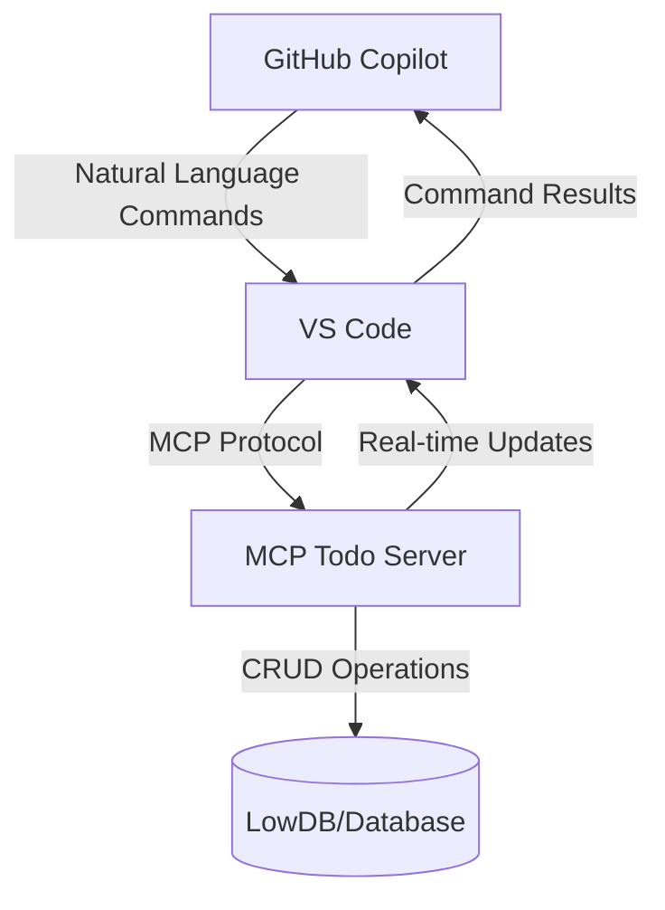

# Building a Todo List Server with Model Context Protocol (MCP)

[](https://github.com/prakashm88/mcp-todo-server)
[](https://nodejs.org/)
[](https://github.com/microsoft/modelcontextprotocol)

This blog post walks through creating a Todo List server using the Model Context Protocol (MCP), demonstrating how to build AI-friendly tools that integrate seamlessly with VS Code.

> 🔗 **Source Code**: The complete implementation is available on [GitHub](https://github.com/prakashm88/mcp-todo-server)

## Table of Contents
- [The Evolution of AI-Assisted Development](#the-evolution-of-ai-assisted-development)
- [What is Model Context Protocol (MCP)?](#what-is-model-context-protocol-mcp)
- [Architecture Overview](#architecture-overview)
- [Prerequisites](#prerequisites)
- [Setting Up the Project](#setting-up-the-project)
- [Implementing the MCP Server](#implementing-the-mcp-server)
- [VS Code Integration](#vs-code-integration)
- [Using the Todo MCP Server](#using-the-todo-mcp-server)
- [Next Steps and Improvements](#next-steps-and-improvements)
- [Troubleshooting](#troubleshooting)
- [Resources](#resources)

## The Evolution of AI-Assisted Development

I have been using VS Code with GitHub Copilot for development purposes. The introduction of text-based chat, which brought GPT capabilities directly into the IDE, was revolutionary. 

### GitHub Copilot and the Local Tools Gap

GitHub Copilot has revolutionized how developers write code by providing intelligent code suggestions and completions. While it excels at understanding code context and generating relevant snippets, there has been a notable gap in its ability to interact with local development tools, intranet KBs, and execute actions in the development environment. This limitation means that while Copilot can suggest code, it cannot directly help with tasks like running commands, managing files, or interacting with local services.

### Agent Mode: Bridging the Gap

The introduction of Agent Mode in GitHub Copilot represents a significant step forward in AI-assisted development. It enables Copilot to:
- Execute terminal commands
- Modify files directly
- Interact with the VS Code environment
- Handle project-specific tasks

This advancement transformed Copilot from a passive code suggestion tool into an active development partner that can help manage your entire development workflow. While tool execution capabilities brought many advantages, they also came with some inherent challenges. Issues such as maintaining tool code, implementing authentication, and managing authorization capabilities created additional overhead for developers. 

### MCP: The New Standard for AI Tool Integration

Model Context Protocol (MCP) emerges as the next evolution in this space, providing a standardized way for AI models to interact with development tools and services. Unlike traditional approaches where AI assistants are limited to suggesting code, MCP enables:

1. **Direct Tool Integration**
   - AI models can directly invoke local tools
   - Real-time interaction with development environment
   - Standardized communication protocol

2. **Extensible Architecture**
   - Custom tool definitions
   - Plugin-based system
   - Easy integration with existing services

3. **Development Environment Awareness**
   - Context-aware assistance
   - Access to local resources
   - Real-time feedback loop

## What is Model Context Protocol (MCP)?

Model Context Protocol (MCP) is a specification that enables AI models to interact with external tools and services in a standardized way. It defines how tools can expose their functionality through a structured interface that AI models can understand and use.

Key benefits of MCP that I have personally benefited from:
- Standardized tool definitions with JSON Schema
- Real-time interaction capabilities
- Session management
- Built-in VS Code integration

[More about MCP Architecture Documentation](https://modelcontextprotocol.io)

### How MCP Tools Work

Each MCP tool follows a standardized structure:

```javascript
{
  name: "toolName",
  description: "What the tool does",
  parameters: {
    // JSON Schema definition of inputs
  },
  returns: {
    // JSON Schema definition of outputs
  }
}
```

When an AI model wants to use a tool:
1. It sends a request with the tool name and parameters
2. The MCP server validates the request
3. The tool executes with the provided parameters
4. Results are returned in a standardized format

This structured approach ensures:
- Consistent tool behavior
- Type safety throughout the system
- Easy tool discovery and documentation
- Predictable error handling

## Architecture Overview

Here's how the different components interact in our MCP Todo implementation:




## Prerequisites

To follow along, you'll need:
- Node.js (v22 or higher)
- VS Code
- Basic understanding of Express.js
- npm or yarn package manager

## Setting Up the Project

1. First, create a new project and initialize npm:

```bash
mkdir mcp-todo-server
cd mcp-todo-server
npm init -y
```

2. Install required dependencies:

```bash
npm install @modelcontextprotocol/sdk express lowdb zod
```

For this demonstration, we're using lowdb to manage tasks in a JSON file without actual integration with an external system. In a production environment, the lowdb functions can be replaced with actual JIRA CRUD API calls for end-to-end implementation. 

3. Create the basic directory structure:

```
mcp-todo-server/
├── src/
│   ├── config/
│   ├── tools/
│   ├── utils/
│   └── server.js
└── package.json
```

## Implementing the MCP Server

### 1. Basic Server Setup

We started with a basic Express server that implements the MCP protocol. The server uses StreamableHTTP for real-time communication and session management.

Key components in `server.js`:
- Express server setup
- MCP SDK integration
- StreamableHTTP transport configuration
- Session management for maintaining tool state

### 2. Database Configuration

We used lowdb, a lightweight JSON database, to persist our todos. The database configuration in `config/db.js` handles:
- JSON file storage
- Basic CRUD operations
- Data persistence between server restarts

### 3. Implementing Todo Tools

We implemented four main tools for managing todos:

1. **createTodo**
   - Creates new todo items
   - Validates input using Zod schema
   - Returns the created todo with a unique ID

2. **listTodos**
   - Lists all todos or filters by completion status
   - Formats output for easy reading
   - Supports real-time updates

3. **updateTodo**
   - Updates todo completion status
   - Validates input parameters
   - Returns updated todo information

4. **deleteTodo**
   - Removes todos by ID
   - Provides completion confirmation
   - Handles error cases gracefully

## VS Code Integration

To enable VS Code to use our MCP server, follow these steps:

1. Enable Agent mode in VS Code. Click on the drop down just before the model listing and select agent from it. 


2. Then click on the Gear icon next to the speaker icon in the above image and select "Add more tools" then select "Add MCP Server"


3. Then select HTTP or Server-Sent Events and provide the URL based on the server we created. In this case, it's http://localhost:3000. Then select a name for the server.


4. Alternatively you can Press `Ctrl+Shift+P` (Windows/Linux) or `Cmd+Shift+P` (Mac) to open the Command Palette. Type "Open Settings (JSON)" and select it and add the following configuration:

```json
{
    "mcp": {
        "servers": {
            "my-mcp-server": {
                "url": "http://localhost:3000/mcp"
            }
        }
    }
}
```
You can use the 4th step to verify if the server is added correctly after the first 3 steps are done. The User Settings option has Start, Stop, and Restart options. This step helped me identify if there are any issues with the MCP tools server effectively.


5. Reload VS Code to apply the changes or use the Start, Stop, Restart options in the settings.json as shown above. 

6. After successful addition of the MCP server, you should see the tools listed when you click the gear icon in the Copilot chat window. 


## Using the Todo MCP Server

Here are some example prompts you can use in VS Code with GitHub Copilot to interact with the todo server. Each example includes a screenshot of the actual interaction:

1. **Creating a Todo**
   ```
   Prompt: "Create a new todo item called 'Review PR #123'"
   Response: Successfully created todo "Review PR #123"
   ```
   
   
   

2. **Listing Todos**
   ```
   Prompt: "Show me all my todos"
   Response: Here are your todos:
   - Review PR #123 (Not completed)
   - Update documentation (Completed)
   - Setup test environment (Not completed)
   ```
   
   
     

3. **Updating a Todo**
   ```
   Prompt: "Mark the todo about PR review as completed"
   Response: Updated "Review PR #123" to completed
   ```

4. **Deleting a Todo**
   ```
   Prompt: "Delete the todo about documentation"
   Response: Successfully deleted "Update documentation"
   ```

5. **Filtering Todos**
   ```
   Prompt: "Show me only completed todos"
   Response: Completed todos:
   - Review PR #123
   ```

## Next Steps and Improvements

Potential enhancements for the project:

1. **Authentication**
   - Add user authentication
   - Implement role-based access

2. **Advanced Features**
   - Due dates for todos
   - Categories/tags
   - Priority levels

3. **Performance**
   - Caching
   - Database optimization
   - Rate limiting

4. **Testing**
   - Unit tests
   - Integration tests
   - Load testing

## Troubleshooting

### Common Issues and Solutions

1. **Server Connection Issues**
   - Verify the server is running on port 3000
   - Check VS Code settings for correct server URL
   - Ensure no firewall blocking the connection

2. **Tool Registration Problems**
   ```
   Error: Tool 'createTodo' not found
   Solution: Check if server is properly initializing tools in server.js
   ```

3. **Schema Validation Errors**
   - Ensure todo items match the required schema
   - Check Zod validation rules in tool implementations
   - Verify JSON payload format

4. **Real-time Updates Not Working**
   - Confirm SSE (Server-Sent Events) connection is established
   - Check browser console for connection errors
   - Verify StreamableHTTP transport configuration

### Source Code Reference

Key implementation files:
- Server setup: [`src/server.js`](src/server.js)
- Tool implementations:
  - [`src/tools/createTodo.js`](src/tools/createTodo.js)
  - [`src/tools/updateTodo.js`](src/tools/updateTodo.js)
  - [`src/tools/deleteTodo.js`](src/tools/deleteTodo.js)
  - [`src/tools/listTodos.js`](src/tools/listTodos.js)
- Database configuration: [`src/config/db.js`](src/config/db.js)

## Conclusion

We've successfully built a fully functional MCP-compatible Todo server that:
- Implements CRUD operations
- Maintains persistent storage
- Provides real-time updates
- Integrates seamlessly with VS Code

This implementation serves as a great starting point for building more complex MCP tools and understanding how AI models can interact with custom tools through the Model Context Protocol.

## Resources

- [MCP SDK Documentation](https://github.com/microsoft/modelcontextprotocol)
- [Express.js Documentation](https://expressjs.com/)
- [Zod Documentation](https://github.com/colinhacks/zod)
- [LowDB Documentation](https://github.com/typicode/lowdb)


# mcp-todo-server

This project is a simple MCP server that manages a todo list using the Model Context Protocol TypeScript SDK. It provides a RESTful API for creating, updating, and deleting todo items.

## Project Structure

```
mcp-todo-server
├── src
│   ├── resources
│   │   └── todos.js
│   ├── tools
│   │   ├── createTodo.js
│   │   ├── updateTodo.js
│   │   └── deleteTodo.js
│   ├── config
│   │   └── db.js
│   ├── utils
│   │   └── sessionManager.js
│   └── server.js
├── db.json
├── package.json
├── .gitignore
└── README.md
```

## Installation

1. Clone the repository:
   ```bash
   git clone https://github.com/prakashm88/mcp-todo-server.git
   cd mcp-todo-server
   ```

2. Install the dependencies:
   ```bash
   npm install
   ```

## Usage

To start the server, run:
```bash
npm start
```

The server will listen on port 3000.

## API Endpoints

- **POST /mcp**: Handles client-to-server communication for creating and managing todos.
- **GET /mcp**: Retrieves server-to-client notifications.
- **DELETE /mcp**: Terminates a session.

## Database

The project uses `lowdb` to manage the todo items, stored in `db.json`.

## Contributing

Contributions are welcome! Here's how you can help:

1. Fork the repository
2. Create a feature branch: `git checkout -b feature/my-new-feature`
3. Commit your changes: `git commit -am 'Add new feature'`
4. Push to the branch: `git push origin feature/my-new-feature`
5. Submit a pull request

You can also:
- Report bugs by creating [issues](https://github.com/prakashm88/mcp-todo-server/issues)
- Suggest improvements through [discussions](https://github.com/prakashm88/mcp-todo-server/discussions)
- Help improve documentation

Please read our [Contributing Guidelines](https://github.com/prakashm88/mcp-todo-server/blob/main/CONTRIBUTING.md) for more details.